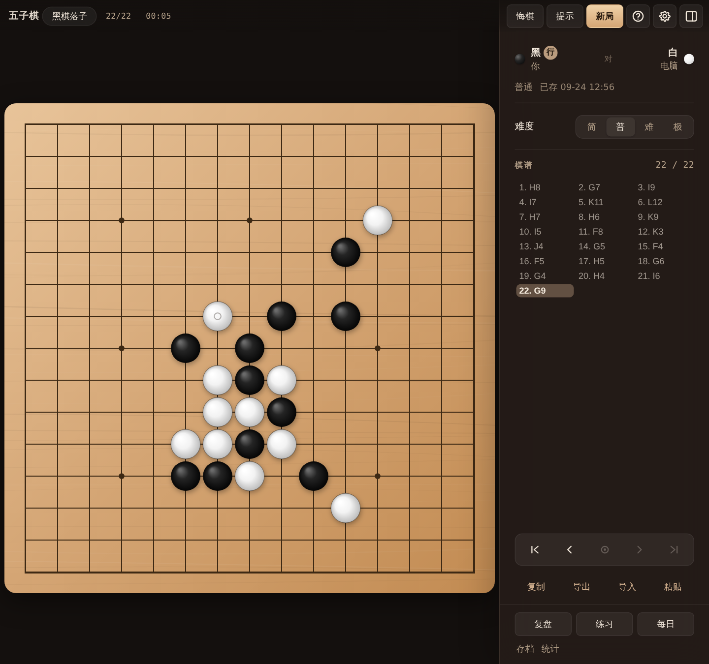
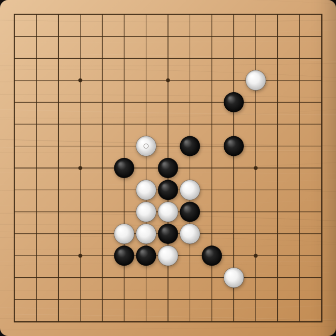
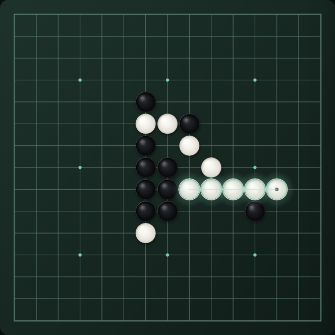
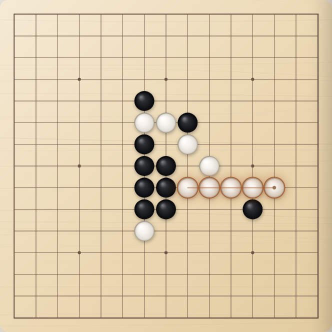
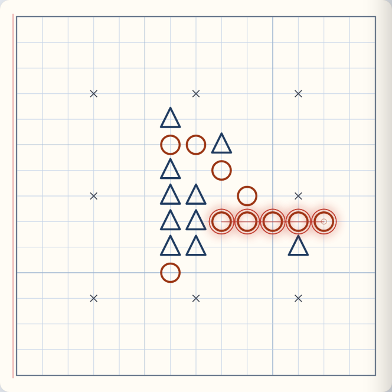
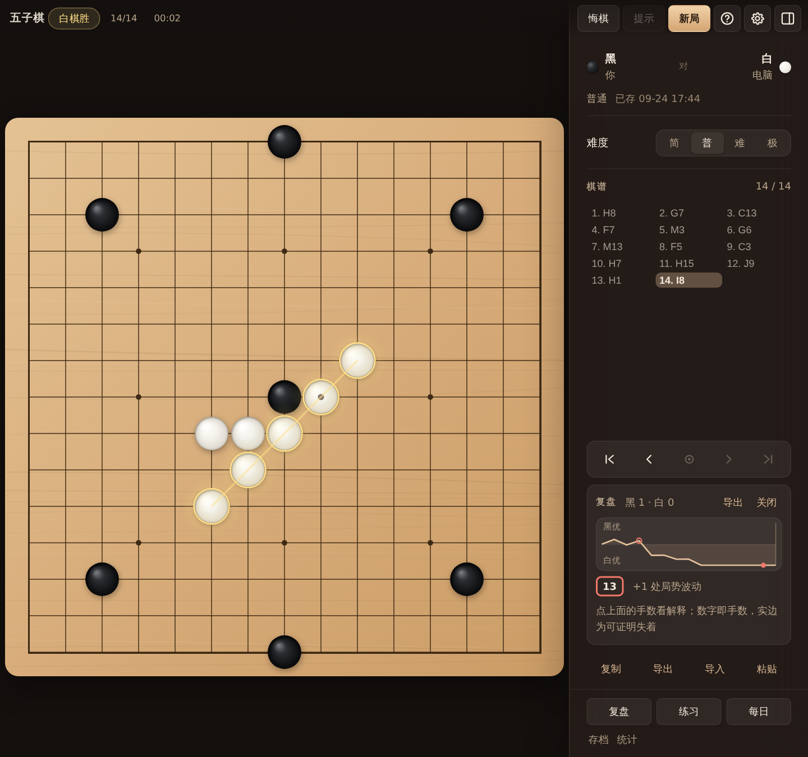

# 五子棋 Goban

五子棋 / Gomoku — macOS 与 Windows 桌面应用。Native SDK WebView + Canvas，**完全离线**：不联网、不要账号、没有任何外部请求。

*A Gomoku (Five in a Row) desktop app for macOS and Windows. Offline, no account, no network. Renju forbidden moves, swap2 opening, game review with proven / engine-compared blunders, replay-the-key-move, spaced tactics practice. Chinese / English.*



## 下载

[Releases](https://github.com/hxddh/goban/releases) 页任选：

| 平台 | 产物 |
|------|------|
| macOS（Apple Silicon） | **Goban-macOS-arm64.zip** |
| Windows（x64） | **Goban-Windows-x64.zip** |

### macOS 首次打开

安装包是 adhoc 签名、**未经 Apple 公证**，所以第一次打开要手动放行一次，之后就和普通应用一样：

1. 解压，把 `Goban.app` 拖进「应用程序」（或 `~/Applications`）
2. 双击 —— 会提示无法验证开发者，点「完成」
3. 打开**系统设置 → 隐私与安全性**，下滑到「安全性」一栏，点 **「仍要打开」**，再确认一次

> **macOS 15（Sequoia）起，「右键 → 打开」这条旧路子已被 Apple 移除**，只能走系统设置。

嫌麻烦，一行命令也行：

```bash
xattr -dr com.apple.quarantine /Applications/Goban.app
# 放在个人目录下的话：xattr -dr com.apple.quarantine ~/Applications/Goban.app
```

### Windows 首次打开

解压后运行 `Goban/goban.exe`。需要 WebView2 运行时（Win10 / 11 一般已预装）。
首次 SmartScreen 会拦一次 —— 点「更多信息 → 仍要运行」。

## 四套棋盘

| 木盘 | 夜盘 |
|:---:|:---:|
|  |  |
| **日间** | **练习本** |
|  |  |

## 复盘

一键分析整局：评分曲线 + 失着列表，点任意一处跳到那一手。可导出带评注的 SGF，也可以就地推演。



## 怎么玩

| 操作 | 说明 |
|------|------|
| 点交叉点 | 落子（须在最新一手；悬停有预览） |
| 侧栏 | 顶栏 **☰** 或 **[** / **]** 开关；对局设置 / 棋谱 / 底部功能入口 |
| 设置 | 顶栏**齿轮**：主题 / 坐标 / 复盘分析 / 语言 / 音效（v1.51 起从侧栏搬进这里） |
| 人机 | 难度 简/普/难/**极**，每档是一句面向玩家的承诺并有闸门证伪（v1.63）：**入门** 挡住你的冲四但常漏活三（实测挡活三 19/40）· **普通** 必挡直接威胁、会算连续冲四（VCF 35/35）· **困难** 会做杀会防杀，每手约 2 秒 · **极限** 同一引擎给足时间（难局 5–8 秒）；难与极 = **C2 引擎**，多出一行「思考」快/标/深 |
| 提示 | **H** / 顶栏「提示」：虚线十字建议点（不自动落子；**复盘中也可用**） |
| 全屏 | **View → Enter Full Screen（⌘⌃F）**；绿键 Zoom |
| 棋谱 | 手数列表点击跳转；复制 / 导出 / 导入 / **粘贴** SGF（可拖入 `.sgf`） |
| 存档 | 侧栏底部「**存档**」：命名保存当前对局、历史列表、读取 / 重命名 / 删除；另有全部数据的备份 / 恢复 |
| 复盘 | 侧栏底部「**复盘**」：一键全局分析 → **评分曲线 + 失着列表**；v1.63 起失着分三档证据——**可证明**（错失一步成五 / 漏防）· **引擎比较**（同一局面同一预算，引擎首选不同且分差可见）· **局势波动**（只有静态分差）；第二遍在后台逐条问引擎，引擎也这么走的失着会被撤掉。点失着跳转后弹层关闭，但**侧栏复盘面板常驻**：全部失着、当前这一手的「当时的威胁 → 你的落点 → 对手怎样惩罚 → 可行替代」，以及 **重下这一手 / 练这一手 / 推演**；导出带评注 SGF 时更优点与重下分支写成**变着** |
| 终局卡 | 一局下完，侧栏顶部出现总结卡（不弹层、棋盘可见）：一句结果、**本局值得记住的一手**、其他关键手；主行动「**重下第 N 手**」，次行动「再来一局」 |
| 重下 | **重下关键一手**：回到失着落下之前，你执失着那一方，电脑按原规则应手；**原局一手不改地保留**，随时「回到原局」；重下的结果不进统计，作为分支挂在原局上 |
| 对局库 | 每一局**下完自动留存**（不用手动存档，滚动 100 局），存档弹层里「最近对局」可随时打开复盘；练习题从这里派生，删掉一局它派生的题也消失；备份一并带走 |
| 规则 | 侧栏·对局「**规则**」三选一 —— 都是「黑先手占优，拿什么补」的答案：**自由**（无禁手、标准开局）/ **swap2**（平衡开局：先手布 3 子，对手选边或加两手；人机下电脑按局面自动选边）/ **禁手**（连珠：黑不得长连、双四、双三，且只有恰好五连算胜；禁手点在盘上画小方框）|
| 禁手档 | **人机可用**：引擎在交货口验一次落子合法性（v1.55），实测自战 12 局 × 2 引擎违规手 **0**。**复盘 v1.56 起也可用**：胜负硬判定（制胜 / 错失胜着 / 漏防）与「更优点」都已按规则算；只剩优劣曲线仍按无禁手估——实测 8 局合法连珠自战 341 手黑棋，黑的静态首选点有 **3.5%** 是禁手点，曲线在这些局面偏乐观。这条偏差就写在复盘弹层里 |
| 练习 | 侧栏底部「**练习**」：战术做题——**找制胜一手 / 挡住成五威胁 / 连续冲四取胜（VCF）/ 找禁手点**（v1.63 新题型），弹层顶部可按题型筛选；**134 道内置题** + 从你对局的失着自动生成（连珠局按连珠判题，题目带原局与手数，可「回到原局」）；**分层提示**：一级指出威胁、二级缩小候选，再看答案；错一次可重试，错两次才摆答案；答案点带坐标标号不只靠颜色；VCF 题**按序号摆出整条制胜顺序**；出题顺序为 未做过 → 错题 → 到期复习 → 其余；旋转 / 镜像的同一题共用一条进度 |
| 错题本 | 练习弹窗「**错题本**」：只做做错过、还没做对的题；答对一次即移出。**掌握**另有定义（v1.63）：独立答对（无提示、首次点击）后按 1 → 3 → 7 → 14 → 30 天排到期复习，**到期后再独立答对才算掌握**；用了提示或看过答案的答对不算。进度（做过 / 已掌握 / 错题 / 今日到期）进「统计」 |
| 每日 | 侧栏底部「**每日**」：每日挑战——每天固定 **5 题**（当天重进同一套题），**到期复习的题先进**，不够再按日期种子补新题；入口上显示今日到期数；完成打卡，**连续打卡天数**进统计 |
| 语言 | 齿轮「**语言**」：中文 / English 全界面切换（含运行时文案），选择随存档保留 |
| 统计 | 侧栏底部「**统计**」：分难度胜负与胜率、连胜、总局数/手数/用时 |
| 导入后 | 默认仅复盘；未终局可点 **续下** 继续（含 AI）；棋谱带 `RU[Renju]` / `RU[Gomoku]` 时按棋谱的规则读（v1.63），往返保留规则 |
| 键盘落子 | Tab 到棋盘：**方向键**移动交叉点，**Enter** 落子，**Esc** 离开；读屏播报坐标、占用与禁手原因（v1.63） |
| 坐标 | 齿轮：A–O / 15–1 标注开关 |
| 复盘分析 | 齿轮：开启后复盘逐手标注优劣（**制胜/错失胜着/漏防/最佳/更优**）；金色菱形指向引擎更优点 |
| 悔棋 / 新局 | **Z** / **N**（有棋时确认） |
| 说明 | **?**（含完整快捷键表与当前版本号） |

## 开发

```bash
cd ~/goban
# 一键：同步 frontend → 单测 → 编译 → 打包 zip → 安装到 ~/Applications
./scripts/package.sh
```

源码布局：

```
src/web/
  index.html · styles.css
  js/core.js       # 规则（纯）
  js/sgf.js        # SGF
  js/ai.js         # C1 引擎：棋型 / VCF·VCT / 迭代 α-β（简/普）
  js/ai2.js        # C2 引擎：增量窗口表 + 深搜索（难/极）
  js/ai-worker.js  # 普通·困难后台计算
  js/host.js       # Native / localStorage 门面
  js/state.js      # 对局状态 / 导入快照
  js/draw.js       # 棋盘 Canvas 渲染
  js/audio.js      # 离线合成音效
  js/slots.js      # 命名存档槽（存取 + 列表渲染）
  js/archive.js    # 对局库：每局下完自动留存 + 重下分支（v1.63）
  js/review.js     # 复盘：评分曲线 / 失着检出 / 证据分层 / 引擎反事实 / 侧栏解释
  js/stats.js      # 对局统计
  js/practice.js   # 战术练习 + 每日挑战 + 错题本 + 分层提示 + 间隔复习（独立小棋盘）
  js/i18n.js       # 中英词典 + t() + 静态标记应用
  js/ui.js         # 展示层：toast / 格式化 / 弹层焦点 / 手数列表 / swap2 提示条
  js/sgfio.js      # SGF 导出：复制 / 保存对话框 / 下载兜底
  js/engine.js     # 引擎桥接：Worker 生命周期 + 降级兜底
  js/app.js        # UI 编排
src/main.zig · src/runner.zig
scripts/package.sh
scripts/test-game.mjs
```

`frontend/dist` 由脚本从 `src/web` 生成。测试：`node scripts/test-game.mjs`；浏览器回归：`node scripts/test-cross.mjs`、`node scripts/test-daily.mjs`、`node scripts/test-loop.mjs`（学习闭环）；棋力与难度承诺：`node scripts/test-strength.mjs`

截图由 `scripts/gen-screenshots.mjs` 从 `src/web` 真实渲染生成（Chromium），不是手工拼的。

## 许可

MIT
